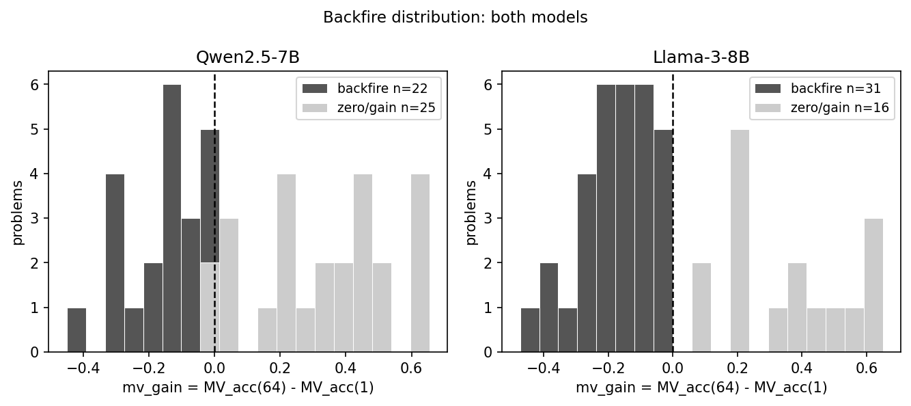
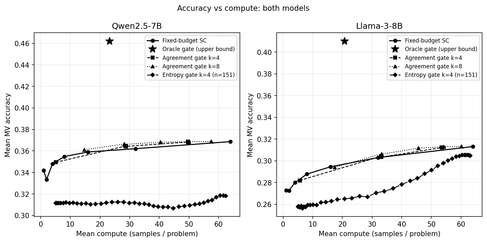
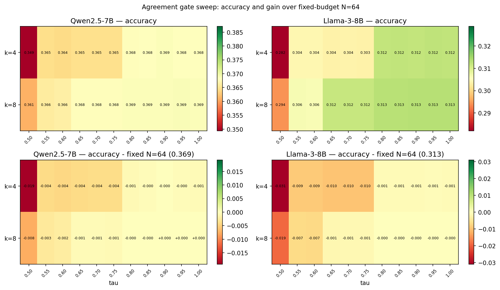
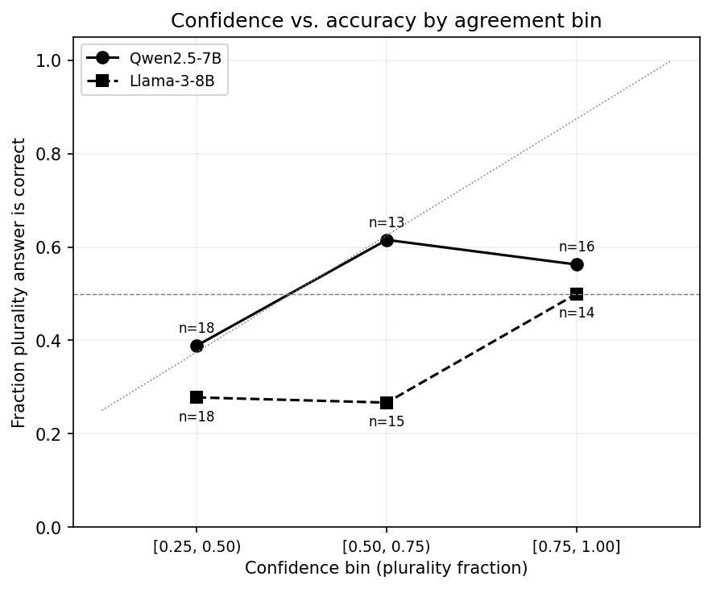

# When Self-Consistency Backfires: Majority Vote Hurts the Majority of Expert-Level Problems

**Abstract.** Self-consistency (SC) via majority vote is a widely used way to spend inference-time compute: sample N chains of thought, return the plurality answer. On the full GPQA Diamond benchmark (198 graduate-level science questions), majority voting reduces per-problem accuracy on a majority of problems for two instruction-tuned models from different families: 56.6% of problems for Qwen2.5-7B and 65.7% for Llama-3-8B. The effect was pre-registered on a 151-problem confirmatory split after being observed on 47 exploratory problems, and all four confirmatory hypotheses passed. A ground-truth oracle that routes each problem between N=1 and N=64 marks a theoretical upper bound 9 to 10 accuracy points above fixed-budget voting, but no verifier-free gate approaches it: a plurality-agreement gate and a token-entropy gate each capture under 1% of that gap and leave accuracy statistically indistinguishable from fixed-budget voting. The mechanism is direct, confidence does not track correctness on these problems: in the highest-agreement bin the plurality answer is correct about half the time for Qwen, and for Llama accuracy actually decreases with agreement. We pre-register and confirm these findings on small instruction-tuned models; we do not test reasoning-native models, which we flag as the central open question.

---

## 1. Introduction

Inference-time compute is a primary lever for LLM reasoning, and self-consistency (sample several chains of thought, return the plurality answer) is among the simplest and most widely used techniques in this family. It is commonly assumed to be a low-risk accuracy boost: sample more, vote, do at least as well.

That assumption fails on hard problems. When a model places its highest probability on an incorrect answer across independent samples, more samples only entrench the wrong vote. We call this _backfire_: mv\_gain = MV\_acc(64) - MV\_acc(1) < 0. We then ask the question a cost-conscious practitioner would ask: can a cheap, verifier-free signal computed from a few samples tell you which problems to vote on and which to skip? We test the two most natural signals, plurality agreement and token-level entropy, and find both fail, and we identify why.

That self-consistency can hurt is not itself new, and the underlying miscalibration is well documented [@guo2017calibration; @kadavath2022language]. Our contribution is to quantify, pre-register, and confirm how often it happens on a full hard benchmark, across two model families, and to show that two cheap gates cannot prevent it.

**Contributions:**

1. On all 198 GPQA Diamond problems, majority voting backfires on the majority of problems for two model families (56.6% and 65.7%). The effect was pre-registered on a 151-problem held-out split and confirmed (all four hypotheses passed).
2. We show the per-problem routing headroom is real, a 9 to 10 point oracle upper bound, but unreachable by two verifier-free gates: plurality agreement and token entropy each capture under 1% of it.
3. We give the mechanism: agreement does not track correctness, and for the weaker model it is anti-correlated.

---

## 2. Setup

**Dataset and design.** We use the full GPQA Diamond benchmark [@rein2023gpqa], 198 graduate-level multiple-choice questions in biology, chemistry, and physics. We adopt a pre-registered confirmatory design: 47 problems are **exploratory** (the hypotheses below were generated from them), and the remaining 151 are a **confirmatory** test set. The hypotheses and thresholds were locked and git-tagged before any confirmatory analysis. We report exploratory, confirmatory, and pooled (198) values throughout, but decide PASS/FAIL on the confirmatory set only.

**Models.** Two instruction-tuned models from different families, served on Together AI: Qwen2.5-7B-Instruct-Turbo and Meta-Llama-3-8B-Instruct-Lite. Both are small (7 to 8B) and non-reasoning. N=64 samples per problem, temperature 0.7, single locked prompt template (SHA-256 verified). Five-pass answer extraction; parse rate 99.5% (Qwen) and 98.6% (Llama).

**Metrics.** MV\_acc(N) is expected majority-vote accuracy over N samples, ties broken uniformly at random independent of ground truth, estimated by Monte Carlo over subsets. Backfire is mv\_gain < 0.

**Routing and gates.** The **oracle** routes each problem to the better of N=1 or N=64 using ground truth; it is a theoretical upper bound, not a deployable method. The **agreement gate** returns the probe plurality when its fraction over k samples is at least tau, else votes at N=64. The **entropy gate** routes by a threshold on mean per-token entropy. Both gates are verifier-free; ground truth is used only to score the result. Logprobs are available for all 151 confirmatory problems but not for the 47 older exploratory ones, so the entropy gate is evaluated on the confirmatory set.

**Uncertainty.** 95% confidence intervals are problem-level bootstrap (1000 iterations, seed 42).

---

## 3. Pre-Registered Confirmatory Results

All four pre-registered hypotheses pass on the 151 confirmatory problems (Table 1). Thresholds were fixed below the exploratory point estimates, so each is a genuine prediction rather than a restatement.

**Table 1.** Confirmatory hypotheses (n=151). Thresholds locked and git-tagged before analysis.

| Hyp | Prediction (both models) | Qwen2.5-7B | Llama-3-8B | Result |
|---|---|---|---|---|
| PH1 | backfire rate >= 33% | 60.3% [53.0, 68.2] | 65.6% [58.3, 73.5] | PASS |
| PH2 | agreement gate captures <= 10% of oracle | 0.8% | -1.6% | PASS |
| PH3 | top-agreement-bin accuracy <= 70% | 51.2% (n=43) | 14.3% (n=21) | PASS |
| PH4 | entropy gate captures <= 10% of oracle | 0.5% | 0.9% | PASS |

---

## 4. Results (Pooled, 198 Problems)

### 4.1 Backfire affects the majority of problems, precisely estimated

Majority voting reduces per-problem accuracy on most problems for both models (Figure 1): the pooled backfire rate is 56.6% (95% CI [49.5, 63.6]) for Qwen and 65.7% ([59.1, 71.7]) for Llama. Expanding from 47 to 198 problems roughly halved the interval width (53% and 55% narrower), and both rates sit well above the 33% threshold.

The aggregate and per-problem pictures diverge. Voting barely moves aggregate accuracy (Qwen 0.342 to 0.369, Llama 0.273 to 0.313) while harming the majority of problems individually. An average that looks flat or mildly positive can hide widespread per-problem harm. The worst single problem loses 47 points (Qwen) or 46 (Llama); a few gain as much as 66 or 71. The asymmetry is real but rare: large gains exist, yet most problems backfire.

{width=100%}

**Figure 1.** mv\_gain = MV\_acc(64) - MV\_acc(1) per problem. Dark bars are backfire (mv\_gain < 0).

### 4.2 The oracle upper bound is real but not reachable

A ground-truth oracle that routes each problem between N=1 and N=64 reaches 0.462 (Qwen) and 0.410 (Llama), 9 to 10 points above fixed-budget voting and at lower mean compute (23 and 21 samples per problem). This marks how much accuracy a perfect per-problem decision would recover. It is an upper bound, not a method (Figure 2).

{width=100%}

**Figure 2.** Accuracy vs mean compute: fixed-budget voting, the oracle upper bound, and the verifier-free agreement and entropy gates.

### 4.3 Two verifier-free gates fail to capture it

Neither cheap gate recovers the headroom. The agreement gate (k=8, tau=0.75) reaches 0.368 accuracy for Qwen and 0.312 for Llama, statistically indistinguishable from fixed-budget voting at N=64 (0.369 and 0.313). The entropy gate does no better, capturing under 1% of the oracle gap on the confirmatory set. The robust statement is that both gates match fixed-budget accuracy; the fraction-of-oracle-captured ratio is near zero but has a small denominator and very wide intervals, so we do not lean on it. Across the full sweep of k and tau, no operating point beats fixed-budget meaningfully (Figure 3). The obvious agreement signal and an uncertainty signal both fail.

{width=100%}

**Figure 3.** Agreement-gate accuracy across the (k, tau) sweep, relative to fixed-budget at matched compute. No operating point wins.

### 4.4 Why: confidence does not track correctness

The reason is direct (Table 2, Figure 4). Binning problems by how concentrated the model's answers are, even the highest-agreement bin is far from reliable: Qwen's plurality is correct 52.5% of the time there, and Llama's only 28.6%, lower than its own low-agreement bin. Llama's accuracy decreases as agreement rises, an anti-calibration pattern. High self-consistency is therefore confidently wrong about as often as confidently right for Qwen, and more often for Llama. A gate that trusts agreement is reading a signal that does not carry the information it needs.

{width=62%}

**Figure 4.** Fraction of plurality answers correct by agreement bin. Both models fall far below the calibration diagonal; Llama trends downward.

**Table 2.** Calibration by agreement bin (pooled 198). Confidence is the plurality fraction over all samples.

| Confidence bin | Qwen n | Qwen frac correct | Llama n | Llama frac correct |
|---|---|---|---|---|
| [0.25, 0.50) | 56 | 33.9% | 79 | 30.4% |
| [0.50, 0.75) | 83 | 27.7% | 84 | 33.3% |
| [0.75, 1.00] | 59 | 52.5% | 35 | 28.6% |

---

## 5. Discussion

**Why backfire occurs.** On hard problems the model's sampling distribution concentrates on a wrong answer, so voting locks in the error. Backfire is not a sampling artifact; it reflects the per-problem answer distribution. GPQA distractors are designed to be plausible [@rein2023gpqa], which amplifies the effect.

**Why the gates fail.** Both gates read confidence (agreement, or low entropy), but confidence on these problems does not indicate correctness, and for the weaker model is inversely related to it. The calibration data make this concrete.

**Positioning.** Prior work established that self-consistency helps on benchmarks where models have higher baseline accuracy [@wang2023self]; we show it hurts the majority of problems on a hard one. Repeated-sampling analyses study coverage under an oracle metric [@brown2024large]; we instead decompose the gap between realizable majority vote and the oracle. Adaptive-consistency early stopping [@aggarwal2023adaptive] is essentially our agreement gate, validated on easier datasets where backfire is rare; our negative result shows agreement stability is insufficient on hard problems. The external-signal direction this motivates, trained verifiers and process reward models [@cobbe2021training; @lightman2023verify], is the natural way to reach the oracle headroom, which our two verifier-free gates cannot.

**Implications.** On hard inputs, do not assume self-consistency is safe, and do not expect agreement or token entropy to tell you when it is; we tested both and both fail. Recovering the headroom likely requires a signal external to the model's own samples.

---

## 6. Limitations

- **Llama is near chance.** Llama-3-8B's single-sample accuracy on full GPQA Diamond is 0.273, just above the 0.25 random baseline, so its backfire is less surprising. Qwen (0.342, clearly above chance) is the stronger demonstration; Llama corroborates the direction.
- **One benchmark.** All results are on GPQA Diamond, graduate-level science. Other domains and easier difficulty regimes may differ.
- **Two small, non-reasoning models.** Reasoning-native architectures (internal chain-of-thought, RL-trained verifiers, adaptive rollouts) are untested, and whether backfire shrinks or persists for them is the central open question this work does not answer.
- **Subset representativeness.** The original 47-problem subset was easier than the full benchmark (Qwen N=1 0.418 vs 0.342 pooled), which is why we report on all 198.
- **Oracle and ratio.** The oracle is an upper bound, not deployable, and the fraction-of-oracle-captured ratio is noisy (small denominator), so we lead gate claims with absolute accuracy.
- **Known mechanism.** Confidence failing to track correctness is an instance of documented overconfidence [@guo2017calibration; @kadavath2022language]; our contribution is the pre-registered, replicated, self-consistency-specific quantification and the failure of two cheap gates, not the existence of miscalibration.

---

## 7. Conclusion

On hard reasoning problems, self-consistency backfires on the majority of problems, pre-registered and confirmed across two model families on the full GPQA Diamond benchmark. The accuracy this leaves on the table is real but unreachable with a verifier-free agreement or entropy gate, because confidence does not track correctness. Whether reasoning-native models escape this is the key open question.

---

## References

[@aggarwal2023adaptive]: Aggarwal et al. 2023. Let's Sample Step by Step: Adaptive-Consistency for Efficient Reasoning with LLMs.

[@brown2024large]: Brown et al. 2024. Large Language Monkeys: Scaling Inference Compute with Repeated Sampling.

[@chen2021codex]: Chen et al. 2021. Evaluating Large Language Models Trained on Code.

[@cobbe2021training]: Cobbe et al. 2021. Training Verifiers to Solve Math Word Problems.

[@guo2017calibration]: Guo et al. 2017. On Calibration of Modern Neural Networks.

[@kadavath2022language]: Kadavath et al. 2022. Language Models (Mostly) Know What They Know.

[@lightman2023verify]: Lightman et al. 2023. Let's Verify Step by Step.

[@rein2023gpqa]: Rein et al. 2023. GPQA: A Graduate-Level Google-Proof Q&A Benchmark.

[@snell2024scaling]: Snell et al. 2024. Scaling LLM Test-Time Compute Optimally.

[@wang2023self]: Wang et al. 2023. Self-Consistency Improves Chain of Thought Reasoning in Language Models.

[@wei2022chain]: Wei et al. 2022. Chain-of-Thought Prompting Elicits Reasoning in Large Language Models.
